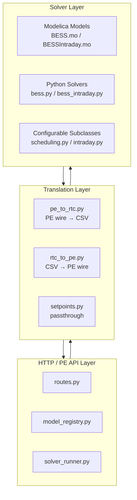
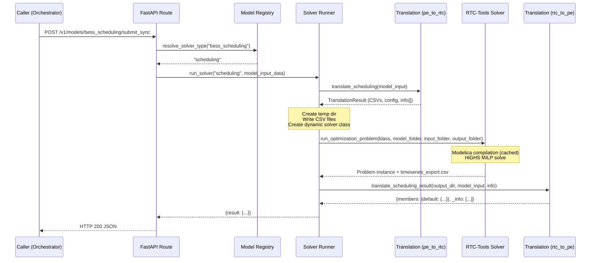

# Architecture Deep Dive

This document provides an in-depth technical overview of the `rtc-tools-bess-demo` system architecture. For getting started and API reference, see [README.md](../README.md).

## Table of Contents

- [Overview](#overview)
- [Primary Design Goals](#primary-design-goals)
- [Non-Goals](#non-goals)
- [System Context](#system-context)
- [Directory Structure](#directory-structure)
- [The Three-Layer Architecture](#the-three-layer-architecture)
- [Data Flow](#data-flow)
- [The Optimiser System](#the-optimiser-system)
- [Key Design Decisions](#key-design-decisions)
- [Sign and Unit Conventions](#sign-and-unit-conventions)
- [Observability](#observability)
- [Quick Reference Checklists](#quick-reference-checklists)
- [Debugging Guide](#debugging-guide)

---

## Overview

This repository is a **Battery Energy Storage System (BESS) optimiser** built on [RTC-Tools](https://www.deltares.nl/en/software-and-data/products/rtc-tools) — a Modelica-based optimisation toolbox. It serves two purposes:

1. **Standalone Demos**: Self-contained scripts demonstrating day-ahead scheduling and continuous intraday (rolling intrinsic) trading strategies for battery storage.
2. **HTTP Service**: A FastAPI wrapper that exposes the same solvers via a PE (PortfolioEnergy) API-compatible REST interface, enabling integration with the backtesting platform.

The optimiser models a battery participating in electricity markets, determining when to charge (buy cheap) and discharge (sell expensive) to maximise profit while considering battery degradation costs, efficiency losses, grid fees, and reserve market obligations (FCR, aFRR).

---

## Primary Design Goals

| Goal | Description |
|------|-------------|
| **PE API Compatibility** | The HTTP service exposes the same wire contract the backtesting platform expects — same endpoint shape, same `model_input_data` / `result` schema |
| **Transparency** | Every ignored input, approximation, and shortcut is surfaced in the `_info` array of the response so callers can audit solver behaviour |
| **Request Isolation** | Concurrent requests cannot contaminate each other — each gets its own temp directory, its own dynamically-created solver class, and its own I/O files |
| **Model Fidelity** | Physics (SoC dynamics, efficiency) lives in Modelica; economics (objective, constraints) lives in Python — clean separation of concerns |
| **Compilation Caching** | pymoca's on-disk compilation cache is preserved across requests so repeated solves avoid expensive Modelica re-compilation |

---

## Non-Goals

| Non-Goal | Rationale |
|----------|-----------|
| **Live trading** | This is an optimiser service; live market connectivity is the platform's responsibility |
| **Market simulation** | The service solves given a snapshot of prices/orderbook — it does not simulate market dynamics |
| **Multi-asset coordination** | Single-battery scope; portfolio-level coordination lives in the orchestrator |
| **State persistence across requests** | Each request is stateless; the backtesting platform manages run state |
| **Sub-PTU resolution** | Designed for 15-min or 1-hour PTUs matching European power market timescales |
| **User authentication** | Assumes trusted environment; security is handled at infrastructure level |
| **Price forecasting** | The service optimises against provided prices; forecasting is the orchestrator's responsibility |

---

## System Context

```mermaid
flowchart TB
    subgraph External
        ORCH[Backtesting Orchestrator]
        DASH[Dashboard / Results]
    end

    subgraph Service["RTC-Tools BESS Optimizer Service (port 8010)"]
        API[FastAPI Routes<br/>POST /v1/models/{name}/submit_sync]
        REG[Model Registry<br/>keyword → solver_type]
        TR_IN[PE → RTC Translation<br/>pe_to_rtc.py]
        RUN[Solver Runner<br/>temp dir orchestration]
        SOL[RTC-Tools Solver<br/>Modelica + Python MILP]
        TR_OUT[RTC → PE Translation<br/>rtc_to_pe.py]
        DIAG[Diagnostics & Reasoning<br/>charts + markdown]
    end

    ORCH -->|"POST model_input_data"| API
    API --> REG
    REG --> RUN
    RUN --> TR_IN
    TR_IN -->|"CSV files"| SOL
    SOL -->|"timeseries_export.csv"| TR_OUT
    TR_OUT --> API
    RUN --> DIAG
    DIAG --> API
    API -->|"JSON result + _info"| ORCH
    API -->|"reasoning_markdown"| DASH
```

---

## Directory Structure

```
rtc-tools-bess-demo/
├── service/                    # HTTP service layer (FastAPI)
│   ├── main.py                 # App entrypoint, health/ready endpoints
│   ├── routes.py               # POST /v1/models/{model_name}/submit_sync
│   ├── model_registry.py       # Keyword → solver_type mapping
│   ├── solver_runner.py        # Temp dir orchestration, solver execution
│   ├── otel_setup.py           # OpenTelemetry bootstrap
│   ├── solvers/                # Configurable solver subclasses
│   │   ├── scheduling.py       # ConfigurableBESS (day-ahead)
│   │   └── intraday.py         # ConfigurableBESSIntraday (rolling intrinsic)
│   └── translation/            # PE API ↔ RTC-Tools format conversion
│       ├── pe_to_rtc.py        # Inbound: PE wire → CSV
│       ├── rtc_to_pe.py        # Outbound: CSV → PE wire
│       ├── setpoints.py        # DA-setpoints shortcut (no solver)
│       ├── diagnostics.py      # Chart generation (matplotlib)
│       └── reasoning.py        # Markdown explainer generation
├── scheduling/                 # Day-ahead demo (standalone)
│   ├── model/BESS.mo           # Modelica physics model
│   ├── input/                  # Demo CSV inputs
│   ├── output/                 # Demo CSV outputs
│   └── src/bess.py             # BESS solver class
├── continuous_intraday/        # Intraday demo (standalone)
│   ├── model/BESSIntraday.mo   # Modelica physics model
│   ├── input/                  # Demo CSV inputs
│   ├── output/                 # Demo CSV outputs
│   └── src/bess_intraday.py    # BESSIntraday solver class
├── tests/                      # pytest suite
├── docs/                       # Documentation (Sphinx + architecture)
├── Dockerfile                  # Container build
└── pyproject.toml              # Dependencies, build config
```

---

## The Three-Layer Architecture



### Layer Responsibilities

| Layer | Responsibility | Must NOT |
|-------|---------------|----------|
| **HTTP / PE API** | Route requests, resolve model names, return structured responses | Contain solver logic or data format knowledge |
| **Translation** | Convert between PE wire format and RTC-Tools CSV; document all approximations in `_info` | Call RTC-Tools directly or hold state |
| **Solver** | Define physics (Modelica), economics (Python objective/constraints), run optimisation | Know about the PE API or HTTP |

### Boundary Rule

The translation layer is the **only** bridge between the PE API world (JSON, timeseries arrays, parameters) and the RTC-Tools world (CSV files, Modelica variables). Neither the HTTP layer nor the solver layer should cross this boundary directly.

---

## Data Flow

A complete request lifecycle for the scheduling solver:



---

## The Optimiser System

### Modelica Physics Models

Both models define the battery's physical dynamics:

| Model | File | Key Equations |
|-------|------|---------------|
| `BESS` | `scheduling/model/BESS.mo` | `3600 * der(soc) = charge_power * sqrt(eff) - discharge_power / sqrt(eff) +/- aFRR_drift` |
| `BESSIntraday` | `continuous_intraday/model/BESSIntraday.mo` | Same SoC dynamics + committed position decomposition + orderbook allocation |

Both models share:
- Parameters: `capacity` (MWh), `efficiency` (round-trip), `max_power` (MW)
- Reserve variables: `fcr_position`, `afrr_up_position`, `afrr_down_position`, bid arrays
- Efficiency model: `sqrt(efficiency)` applied per leg (charge/discharge), giving round-trip `efficiency`

### Python Solver Classes

The Python layer (inheriting from RTC-Tools' `CollocatedIntegratedOptimizationProblem`) defines:

| Concern | Method | Role |
|---------|--------|------|
| Objective | `path_objective()` | Revenue - cycling penalty - grid fees + reserve standby/activation revenue |
| Terminal value | `objective()` | Stored energy value (EUR/MWh) for end-of-horizon SoC |
| Path constraints | `path_constraints()` | Complementarity, power headroom, SoC LER constraints |
| Cross-time constraints | `constraints()` | Block-equality on reserve bids across same-price blocks |
| Solver config | `solver_options()` | HiGHS MILP via CasADi qpsol interface |

### Solver Types

| Type | Class | Description |
|------|-------|-------------|
| `scheduling` | `BESS` / `ConfigurableBESS` | Day-ahead: single full-horizon solve against price forecast. Reserve bids as decision variables. |
| `intraday` | `BESSIntraday` / `ConfigurableBESSIntraday` | Rolling intrinsic: orderbook segments with bid/ask volumes. Reserves committed-only (never bids). |
| `da_setpoints` | *(no solver)* | Passthrough: `market_position` -> `setpoints` without optimisation |

---

## Key Design Decisions

### 1. CSV-Based Solver I/O Contract

**Why**: RTC-Tools communicates via CSV files (`timeseries_import.csv`, `initial_state.csv`, `parameters.csv` -> `timeseries_export.csv`). This is the framework's native interface.

**Implication**: The translation layer's sole job is format conversion. No in-memory coupling between the PE API and RTC-Tools internals.

### 2. Dynamic Class-per-Request

**Why**: RTC-Tools solver classes hold mutable state during a solve. Concurrent requests must not share instances.

**Decision**: Each request creates a unique solver subclass via `type(f"BESS_{uuid4().hex[:8]}", (ConfigurableBESS,), {...})`. Class attributes inject per-request configuration (cycling penalty, stored energy value, reserve config).

**Implication**: No shared mutable state between requests. The solver class exists only for the duration of one solve.

### 3. Dummy Timestep Prepend

**Why**: RTC-Tools' backward Euler (theta=1) leaves controls at the first collocation point decoupled from SoC dynamics. Without compensation, the first real PTU has no proper SoC transition.

**Decision**: Prepend one dummy timestep (zero prices, zero volumes) before the real trading window. The initial SoC boundary condition is absorbed by this dummy row.

**Implication**: Output CSVs have one extra row at the front. The translation layer strips it before returning results.

### 4. Transparency via `_info`

**Why**: The local solver does not implement every PE API feature. Callers need to know what was ignored or approximated.

**Decision**: The `_info` array in every response documents:
- `ignored_input:` — PE fields present but not used
- `approximation:` — simplifications (e.g., merged efficiencies)
- `applied:` — inputs that were actively used
- `not_in_output:` — PE output fields not produced
- `solver:` — solver engine details

### 5. Single max_power Approximation

**Why**: The Modelica model uses a single `max_power` parameter; the PE API provides separate `max_charge_power` and `max_discharge_power`.

**Decision**: `max_power = min(max_charge_power, max_discharge_power)`. Documented in `_info`.

### 6. Round-trip Efficiency Model

**Why**: The PE API provides `efficiency_in` and `efficiency_out` separately; the Modelica model uses a single `efficiency` parameter with `sqrt(efficiency)` per leg.

**Decision**: `efficiency = efficiency_in * efficiency_out`. The Modelica equation `charge * sqrt(eff) - discharge / sqrt(eff)` then correctly models the round-trip.

### 7. Compilation Cache Strategy

**Why**: pymoca compilation is expensive (~seconds). Repeated solves with the same model should reuse the cache.

**Decision**:
- **Scheduling**: Uses the permanent `scheduling/model/` directory. pymoca writes `.pymoca_cache` there.
- **Intraday**: The `.mo` file must be patched per `n_segments` value. A stable per-`n_segments` temp directory is created lazily (with write-lock for thread safety) and reused for the process lifetime.

### 8. Reserve Market Integration

**Why**: The backtesting platform co-optimises energy and ancillary services (FCR, aFRR up/down).

**Decision**:
- **Scheduling solver**: Reserve bids are decision variables. Block-equality constraints ensure constant bids across same-price blocks. LER and power-headroom constraints ensure physical feasibility.
- **Intraday solver**: Reserves are committed-only (bids pinned to zero). Committed positions still tighten SoC headroom and power limits.

### 9. Counterfactual Reserve Re-solve

**Why**: When diagnostics are enabled, the platform wants to quantify the EUR delta that reserves contributed to the portfolio.

**Decision**: Optionally re-solve the same horizon with all reserve inputs stripped. Compare metrics to produce a "with reserves" vs. "without reserves" analysis. Suppressed via `skip_counterfactual_reserves=1` parameter.

---

## Sign and Unit Conventions

### Units

All values in the Modelica models, CSV files, and PE API use **MW** (power) and **MWh** (energy). There is no kW/kWh layer in this system.

| Quantity | Unit | Examples |
|----------|------|---------|
| Power | MW | `charge_power`, `discharge_power`, `max_power`, `bid_volumes[N]` |
| Energy | MWh | `soc`, `capacity` |
| Price | EUR/MWh | `price`, `bid_prices[N]`, `ask_prices[N]` |
| Standby price | EUR/MW/h | `fcr_standby_price`, `afrr_up_standby_price` |
| Grid fee | EUR/MWh | `grid_fee_in`, `grid_fee_out` |

### Sign Convention

| Variable | Positive (+) | Negative (-) |
|----------|-------------|--------------|
| `charge_power` | Battery charging (importing from grid) | *(always >= 0)* |
| `discharge_power` | Battery discharging (exporting to grid) | *(always >= 0)* |
| `net_power` | Discharging (export) | Charging (import) |
| `market_position` | Discharging (selling to market) | Charging (buying from market) |

**Key rule**: `charge_power` and `discharge_power` are always non-negative. Complementarity constraints prevent both from being simultaneously positive (for incremental trades). `net_power = discharge_power - charge_power`.

### Reserve Sign Convention

All reserve quantities (`fcr_position`, `afrr_up_position`, `afrr_down_position`, bid totals) are **non-negative MW capacities** — they represent reserved headroom, not directional power flow.

### SoC Dynamics Equation

```
3600 * der(soc) = charge_power * sqrt(efficiency)
               - discharge_power / sqrt(efficiency)
               + total_afrr_down * afrr_activation_fraction * sqrt(efficiency)
               - total_afrr_up * afrr_activation_fraction / sqrt(efficiency)
```

- Charging adds to SoC (with sqrt(efficiency) loss)
- Discharging removes from SoC (with 1/sqrt(efficiency) loss)
- aFRR down activation charges (positive drift)
- aFRR up activation discharges (negative drift)
- FCR is symmetric — net zero expected SoC drift

---

## Observability

### OpenTelemetry

The service integrates OTEL for traces, metrics, and logs:

| Signal | Exporter | Fallback |
|--------|----------|----------|
| Traces | OTLP gRPC (`OTLPSpanExporter`) | Console |
| Metrics | OTLP gRPC (`OTLPMetricExporter`) | Console |
| Logs | OTLP gRPC (`OTLPLogExporter`) | Console |

Configuration via standard OTEL environment variables (`OTEL_EXPORTER_OTLP_ENDPOINT`, `OTEL_SERVICE_NAME`).

### Diagnostics Mode

When `include_diagnostics: true` is set in the request:

1. **Charts** are generated as base64 PNG data URIs and embedded in `_info` entries prefixed with `image:<name>:`
2. **Reasoning markdown** is returned as a top-level `reasoning_markdown` key — a structured explainer with KPI tables, cycle merit orders, and inline charts
3. **Counterfactual re-solve** (optional) compares "with reserves" vs. "without reserves"

---

## Quick Reference Checklists

### Adding a New Solver Type

1. Create the solver class in `service/solvers/`
2. Add keyword mappings in `service/model_registry.py`
3. Add `translate_<type>()` in `service/translation/pe_to_rtc.py`
4. Add `translate_<type>_result()` in `service/translation/rtc_to_pe.py`
5. Add the dispatch branch in `service/solver_runner.py`
6. Add test fixtures in `tests/conftest.py`

### Adding a New PE API Input Field

1. Handle in the appropriate `translate_*()` function in `pe_to_rtc.py`
2. If used: map to CSV column, append `applied:` to `_info`
3. If ignored: append `ignored_input:` to `_info`
4. If approximated: append `approximation:` to `_info`
5. Add test coverage in `tests/test_translation.py`

### Adding a New Constraint to the Solver

1. Add the constraint in `path_constraints()` or `constraints()` of the appropriate solver class
2. If it requires new Modelica variables, update the `.mo` file
3. If it requires new input data, update the translation layer
4. Document in `_info` if the constraint makes approximations

### Modifying the Modelica Model

1. Edit `scheduling/model/BESS.mo` or `continuous_intraday/model/BESSIntraday.mo`
2. Delete any `.pymoca_cache` files to force recompilation
3. Ensure new `input Real` variables are mapped in the translation layer
4. Ensure new `output Real` variables are read in `rtc_to_pe.py`

---

## Debugging Guide

### Inspecting Translation Output

Run the translation layer in isolation:

```python
from service.translation.pe_to_rtc import translate_scheduling
result = translate_scheduling(model_input_data)
print(result.timeseries_csv)   # CSV that would be written
print(result.initial_state_csv)
print(result.info)             # Approximation log
```

### Verifying Solver Output

Enable diagnostics in the request to get full explainer output:

```json
{
  "model_input_data": {...},
  "include_diagnostics": true
}
```

The response includes `reasoning_markdown` with:
- Energy balance tables
- Per-cycle merit order
- Constraint binding analysis
- Revenue decomposition charts

### Common Failure Modes

| Symptom | Likely Cause | Fix |
|---------|-------------|-----|
| 404 on submit | Model name not in registry | Check `model_registry.py` keyword list |
| 422 on submit | Missing required timeseries (e.g., `afrr_activation_fraction` for open reserve market) | Supply the required timeseries |
| 500 + infeasible | Conflicting constraints (e.g., SoC LER impossible with given capacity) | Relax parameters or check reserve T_min |
| Slow first request | pymoca compilation (cold cache) | Normal — subsequent requests use cache |
| Different results from PE solver | Expected — local solver uses HiGHS, PE may use a different engine | Check `_info` for documented approximations |

### Running Tests

```bash
uv run pytest                           # All tests
uv run pytest tests/test_translation.py # Translation layer only
uv run pytest tests/test_api.py         # HTTP contract only
```
